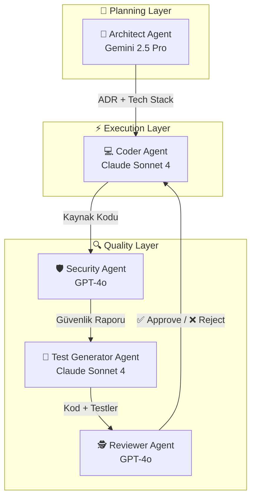
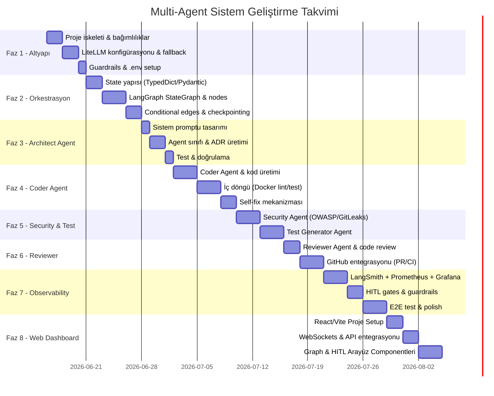

# 🗺️ Uçtan Uca Yol Haritası: Multi-Agent Otonom Mobil Uygulama Geliştirme Sistemi

> **Proje Başlangıç Tarihi:** 16 Haziran 2026  
> **Hedef:** Kullanıcı fikrini alıp, otonom ajanlar (AI modelleri) aracılığıyla uçtan uca mobil uygulama geliştiren production-grade bir sistem inşa etmek.

---

## 📋 İçindekiler

1. [Vizyon & Hedef](#1-vizyon--hedef)
2. [Sistemdeki Ajanlar](#2-sistemdeki-ajanlar)
3. [Teknoloji Yığını](#3-teknoloji-yığını-tech-stack)
4. [Hibrit Workflow (İç Döngü + Dış Döngü)](#4-hibrit-workflow)
5. [Geliştirme Fazları & Zaman Çizelgesi](#5-geliştirme-fazları--zaman-çizelgesi)
6. [Dosya/Klasör Yapısı](#6-dosyaklasör-yapısı)
7. [Feature Backlog & Önceliklendirme](#7-feature-backlog--önceliklendirme)
8. [Risk Analizi & Azaltma Stratejileri](#8-risk-analizi--azaltma-stratejileri)
9. [Başarı Metrikleri (KPI)](#9-başarı-metrikleri-kpi)

---

## 1. Vizyon & Hedef

```
Kullanıcı Fikri → 🧠 AI Ajanlar → 📱 Production-Ready Mobil Uygulama
```

**Temel İlke:** İnsan yaratıcılığı (fikir) + Yapay Zeka verimliliği (uygulama) = Hızlı, güvenli, kaliteli mobil uygulama.

**Hedef Çıktı:**
- ✅ Clean Architecture uyumlu, test edilmiş kaynak kodu
- ✅ GitHub'da PR-review sürecinden geçmiş, merge edilmiş repo
- ✅ CI/CD pipeline'ı hazır, deploy edilebilir uygulama
- ✅ ≥70% test coverage
- ✅ OWASP Mobile Top 10 güvenlik taramasından geçmiş

---

## 2. Sistemdeki Ajanlar



| Ajan | Model (Primary) | Model (Fallback) | Temel Görev |
|------|----------------|-------------------|-------------|
| 🧠 **Architect** | Gemini 2.5 Pro | Claude Sonnet 4 | Mimari kararlar, platform seçimi, ADR üretimi |
| 💻 **Coder** | Claude Sonnet 4 | Gemini 2.5 Pro | Kod üretimi, self-fix (iç döngü) |
| 🛡️ **Security** | GPT-4o | Gemini 2.5 Pro | OWASP tarama, secret detection, dependency audit |
| 🧪 **Test Generator** | Claude Sonnet 4 | GPT-4o | Unit/widget/integration test üretimi |
| 🕵️ **Reviewer** | GPT-4o | Claude Opus 4 | Code review, CI log analizi, PR yönetimi |

---

## 3. Teknoloji Yığını (Tech Stack)

| Katman | Teknoloji | Amaç |
|--------|-----------|------|
| **Orkestrasyon** | LangGraph `>= 1.0.10` | Ajan iş akışı, state machine, döngüsel workflow, supervisor pattern |
| **LLM Gateway** | LiteLLM **Router SDK** (in-process) | Multi-provider routing, fallback chain — proxy sunucusu **kullanılmıyor** |
| **State Pattern** | `TypedDict` + `Annotated` reducer | `add_messages`, `operator.add` ile güvenli state birleştirme |
| **Gözlemlenebilirlik** | LangSmith (`LANGSMITH_TRACING=true`) + Prometheus + Grafana | Otomatik trace (zero-config), metrik, dashboard, alerting |
| **API** | FastAPI | REST API + WebSocket (real-time progress) |
| **CI/CD** | GitHub Actions | Build, test, deploy otomasyonu |
| **VCS** | GitHub (PyGithub) | PR yönetimi, code review, auto-merge |
| **Execution** | Docker | İzole lint/test/build ortamı |
| **State/Cache** | Redis | Hızlı state erişimi, task queue |
| **Memory** | ChromaDB | RAG — kütüphane dökümanları vektör araması |
| **Veritabanı** | PostgreSQL + `psycopg_pool` | Proje geçmişi + **checkpointing** (⚠️ CVE-2025-67644: SQLite kullanılmayacak) |
| **Güvenlik** | Semgrep + GitLeaks + Snyk | SAST, secret scan, dependency audit |

---

## 4. Hibrit Workflow

### İç Döngü (Lokal / Hızlı) — GitHub'ı kirletmeden

```
Coder Agent → Docker Lint → Hata? → Self-Fix (max 3x) → Unit Test → ✅ PR'a Hazır
```

### Dış Döngü (GitHub / CI) — Formal review süreci

```
PR Aç → GitHub Actions CI → Reviewer Agent → Approve? → Auto-Merge → Deploy
                                                ↓ Reject
                                        Feedback → Coder Agent → Fix → PR Update
```

### HITL (Human-in-the-Loop) Kontrol Noktaları

| Gate | Tetiklenme Koşulu | Gerekli Aksiyon |
|------|-------------------|-----------------|
| 🛑 **Gate 1** | Architect kararları üretildi | İnsan mimari kararları onaylar |
| 🛑 **Gate 2** | Security scan kritik CVE buldu | İnsan riski değerlendirir |
| 🛑 **Gate 3** | Production deploy hazır | İnsan deploy onayı verir |
| 🛑 **Gate 4** | Maliyet threshold aşıldı | İnsan bütçe onayı verir |

---

## 4.5 Teknik Araştırma Kararları Özeti

Aşağıdaki kararlar, LangGraph/LiteLLM ekosisteminin 2025-2026 güncel araştırmasına dayanmaktadır.

| # | Bulgu | Karar | Gerekçe |
|---|-------|-------|---------|
| 1 | LangGraph `StateGraph` + `Annotated` reducer pattern | State'de `add_messages`, `operator.add` gibi reducer'lar kullanacağız | Thread-safe, partial dict döndürme, otomatik birleştirme |
| 2 | LiteLLM `Router` sınıfı ile in-process fallback | Proxy sunucusu yerine doğrudan Python SDK Router tercih edeceğiz | Daha basit, ekstra altyapı gerektirmez, düşük latency |
| 3 | Hibrit state yaklaşımı (TypedDict iç, Pydantic dış) | İç state `TypedDict`, API sınırları `Pydantic BaseModel` olacak | İç state hafif/hızlı, dış sınırlar validasyonlu/güvenli |
| 4 | `LANGSMITH_TRACING=true` otomatik trace | Ekstra kod yazmadan LangSmith entegrasyonu | Zero-config, tüm graph/LLM/tool çağrıları otomatik trace |
| 5 | `create_react_agent` + handoff tools supervisor pattern | Orchestrator'da modern supervisor pattern kullanılacak | Her worker `create_react_agent` ile oluşturulur, supervisor handoff ile yönlendirir |
| 6 | ⚠️ CVE-2025-67644: SQLite checkpointer güvenlik açığı | Production'da **PostgreSQL checkpointer** kullanılacak | SQLite/Redis checkpointer'da SQL injection açığı, `langgraph >= 1.0.10` zorunlu |

---

## 5. Geliştirme Fazları & Zaman Çizelgesi



### Faz Detayları

| Faz | Süre | Anahtar Çıktılar |
|-----|------|------------------|
| **Faz 1:** Altyapı | ~5 gün | `pyproject.toml`, `litellm_config.yaml`, `guardrails.yaml`, `.env.example` |
| **Faz 2:** Orkestrasyon | ~7 gün | `state.py`, `graph.py`, `nodes.py`, `edges.py` |
| **Faz 3:** Architect | ~4 gün | `architect/agent.py`, `architect/schemas.py`, prompt dosyaları |
| **Faz 4:** Coder | ~8 gün | `coder/agent.py`, `inner_loop.py`, `docker_runner.py` |
| **Faz 5:** Security & Test | ~6 gün | `security/agent.py`, `owasp_rules.py`, `test_generator/agent.py` |
| **Faz 6:** Reviewer | ~5 gün | `reviewer/agent.py`, `github_client.py` |
| **Faz 7:** Observability | ~8 gün | `metrics.py`, `langsmith_tracer.py`, `hitl.py`, `guardrails.py`, dashboards |
| **Faz 8:** Web Dashboard | ~7 gün | `/frontend` React/Vite uygulaması, WebSocket & API entegrasyonu, HITL UI |
| **TOPLAM** | **~50 gün** | **~43 dosya, uçtan uca görselleştirilebilir production-ready sistem** |

---

## 6. Dosya/Klasör Yapısı

```
Multi-Agent/
├── docs/                              # 📚 Proje dokümanları
│   ├── 01_hybrid_architecture_analysis.md
│   ├── 02_implementation_plan.md
│   └── 03_roadmap.md                  # ← Bu dosya
│
├── config/                            # ⚙️ Konfigürasyon
│   ├── litellm_config.yaml            # LLM model tanımları & fallback
│   ├── guardrails.yaml                # Maliyet/iterasyon limitleri
│   └── prompts/                       # Ajan sistem promptları
│       ├── architect_system.md
│       ├── coder_system.md
│       ├── reviewer_system.md
│       ├── security_system.md
│       └── test_generator_system.md
│
├── src/                               # 🐍 Kaynak Kod
│   ├── __init__.py
│   ├── agents/                        # 🤖 Ajan Modülleri
│   │   ├── __init__.py
│   │   ├── architect/
│   │   │   ├── __init__.py
│   │   │   ├── agent.py               # ArchitectAgent sınıfı
│   │   │   └── schemas.py             # Pydantic output şemaları
│   │   ├── coder/
│   │   │   ├── __init__.py
│   │   │   ├── agent.py               # CoderAgent sınıfı
│   │   │   └── inner_loop.py          # İç döngü runner
│   │   ├── reviewer/
│   │   │   ├── __init__.py
│   │   │   └── agent.py               # ReviewerAgent sınıfı
│   │   ├── security/
│   │   │   ├── __init__.py
│   │   │   ├── agent.py               # SecurityAgent sınıfı
│   │   │   └── owasp_rules.py         # OWASP Mobile Top 10 kuralları
│   │   └── test_generator/
│   │       ├── __init__.py
│   │       └── agent.py               # TestGeneratorAgent sınıfı
│   │
│   ├── orchestrator/                  # 🎭 Orkestrasyon
│   │   ├── __init__.py
│   │   ├── state.py                   # State veri yapısı
│   │   ├── graph.py                   # LangGraph StateGraph
│   │   ├── nodes.py                   # Graph node fonksiyonları
│   │   ├── edges.py                   # Conditional edge'ler
│   │   ├── hitl.py                    # Human-in-the-Loop gates
│   │   └── guardrails.py             # Maliyet & döngü limitleri
│   │
│   ├── integrations/                  # 🔌 Dış Servis Entegrasyonları
│   │   ├── __init__.py
│   │   ├── litellm_client.py          # LiteLLM Router wrapper
│   │   ├── github_client.py           # GitHub API wrapper
│   │   └── docker_runner.py           # Docker execution manager
│   │
│   ├── observability/                 # 📊 Gözlemlenebilirlik
│   │   ├── __init__.py
│   │   ├── langsmith_tracer.py        # LangSmith callback handler
│   │   └── metrics.py                 # Prometheus metrikleri
│   │
│   └── api/                           # 🌐 REST API
│       ├── __init__.py
│       └── main.py                    # FastAPI entry point
│
├── frontend/                          # 💻 Web Dashboard (UI - React + Vite)
│   ├── package.json
│   ├── vite.config.ts
│   ├── index.html
│   ├── src/
│   │   ├── App.tsx                    # Ana component & layout
│   │   ├── index.css                  # Global CSS variables & styling
│   │   ├── hooks/
│   │   │   └── useWebSocket.ts        # Canlı state & log akışı dinleyici
│   │   └── components/
│   │       ├── AgentGraph.tsx         # LangGraph görselleştirici
│   │       ├── HITLPanel.tsx          # Etkileşimli onay paneli (ADR, Security, Deploy)
│   │       ├── TerminalLogs.tsx       # Canlı terminal log penceresi
│   │       └── MetricCards.tsx        # Maliyet ve token analiz grafikleri
│   └── public/
│
├── tests/                             # 🧪 Testler
│   ├── test_architect.py
│   ├── test_coder.py
│   ├── test_reviewer.py
│   ├── test_security.py
│   ├── test_orchestrator.py
│   └── test_e2e_workflow.py
│
├── monitoring/                        # 📈 Monitoring
│   ├── prometheus.yml
│   └── grafana/
│       └── dashboards/
│           └── agents.json
│
├── .env.example                       # 🔑 Environment değişkenleri şablonu
├── .gitignore
├── docker-compose.yml                 # 🐳 Docker servisleri
├── pyproject.toml                     # 📦 Python bağımlılıkları
└── README.md                          # 📖 Proje açıklaması
```

---

## 7. Feature Backlog & Önceliklendirme

### ✅ MVP (v1.0) — Bu roadmap kapsamında

| # | Feature | Faz |
|---|---------|-----|
| 1 | LiteLLM Fallback Model Chain | Faz 1 |
| 2 | LangGraph Orchestrator + State Management | Faz 2 |
| 3 | Architect Agent (ADR üretimi) | Faz 3 |
| 4 | Coder Agent + İç Döngü Self-Fix | Faz 4 |
| 5 | Security Agent (OWASP + GitLeaks) | Faz 5 |
| 6 | Test Generator Agent | Faz 5 |
| 7 | Reviewer Agent + GitHub PR Entegrasyonu | Faz 6 |
| 8 | LangSmith + Prometheus + Grafana Observability | Faz 7 |
| 9 | HITL Kontrol Noktaları (3 gate) | Faz 7 |
| 10 | Cost Guardrails | Faz 7 |
| 11 | Incremental (Modül Bazlı) Kod Üretimi | Faz 4 |

### 🔶 v2.0 — Sonraki Aşama

| # | Feature | Açıklama |
|---|---------|----------|
| 12 | Design Agent (Figma → Kod) | Figma API/MCP ile UI'dan koda dönüşüm |
| 13 | RAG-Powered Coding | Kütüphane dökümantasyonu vektör DB'den çekme |
| 14 | Multi-Screen Parallelism | Birden fazla ekranı eş zamanlı geliştirme |
| 15 | Rollback Mechanism | Hatalı deploy sonrası otomatik geri alma |
| 16 | Conversation Memory | Önceki proje kararlarını hatırlama (ChromaDB) |

### 🔷 v3.0 — Gelecek Vizyon

| # | Feature | Açıklama |
|---|---------|----------|
| 17 | Self-Learning Loop | Reviewer feedback'lerinden prompt otomatik güncelleme |
| 18 | Voice-to-App | Whisper API ile sesli komuttan uygulama |
| 19 | A/B Variant Generation | Aynı ekranın birden fazla versiyonunu üretme |
| 20 | Analytics Integration | Otomatik Firebase/Mixpanel entegrasyonu |

---

## 8. Risk Analizi & Azaltma Stratejileri

| Risk | Olasılık | Etki | Azaltma Stratejisi |
|------|----------|------|-------------------|
| **Sonsuz döngü** (Coder ↔ Reviewer) | Yüksek | Kritik | `max_iterations` limiti (iç: 3, dış: 5) + HITL escalation |
| **Token patlaması** (maliyet) | Orta | Yüksek | `guardrails.yaml` cost ceiling + per-agent token limits |
| **API provider downtime** | Orta | Yüksek | LiteLLM fallback chain (3 provider) + retry logic |
| **Düşük kod kalitesi** | Orta | Orta | Multi-layer review (lint → security → test → reviewer) |
| **State kaybı** (crash) | Düşük | Kritik | LangGraph checkpointing (PostgreSQL) + Redis cache |
| **Secret sızıntısı** | Düşük | Kritik | GitLeaks pre-commit hook + Security Agent taraması |
| **Hallucination** (yanlış kod) | Yüksek | Orta | Docker'da gerçek build/test + lint doğrulaması |
| **Context window aşımı** | Orta | Orta | Modül bazlı incremental generation + diff-only feedback |

---

## 9. Başarı Metrikleri (KPI)

### Sistem Performans Metrikleri

| KPI | Hedef | Ölçüm Yöntemi |
|-----|-------|----------------|
| **Uçtan uca süre** (fikir → çalışan uygulama) | < 30 dakika (basit uygulama) | LangSmith trace |
| **İlk seferde lint geçme oranı** | > 60% | Inner loop metrics |
| **Self-fix başarı oranı** | > 70% | Inner loop iteration count |
| **Reviewer ilk seferde onay oranı** | > 40% | PR review metrics |
| **Test coverage** | ≥ 70% | Docker test runner |
| **Güvenlik skoru** | ≥ 80/100 | Security Agent raporu |
| **Proje başına ortalama maliyet** | < $5 (basit), < $30 (karmaşık) | Cost tracker |

### Kalite Metrikleri

| KPI | Hedef |
|-----|-------|
| Üretilen kodun SOLID uyumu | Reviewer Agent değerlendirmesi |
| Clean Architecture katman ihlali | 0 ihlal |
| Kritik güvenlik açığı (CVE HIGH+) | 0 |
| Hardcoded secret sayısı | 0 |

---

## 📎 Ek Dokümanlar

| Doküman | Açıklama |
|---------|----------|
| [01_hybrid_architecture_analysis.md](./01_hybrid_architecture_analysis.md) | Hibrit mimari detayları, UI katmanı, iç/dış döngü, production-grade öneriler |
| [02_implementation_plan.md](./02_implementation_plan.md) | Dosya bazlı implementasyon planı (8 faz, ~43 dosya) |
| [04_sprint_plan.md](./04_sprint_plan.md) | Sprint & PR planı (8 sprint, 11 PR, branch stratejisi, DoD, milestone'lar) |

---

> [!NOTE]
> Bu yol haritası yaşayan bir belgedir. Her faz tamamlandıkça güncellenecektir.
>
> **Son güncelleme:** 16 Haziran 2026
