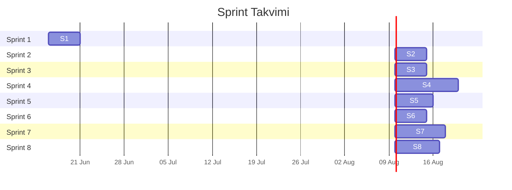
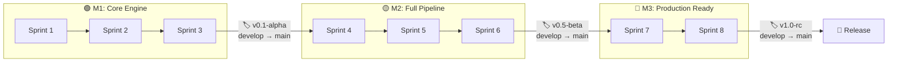
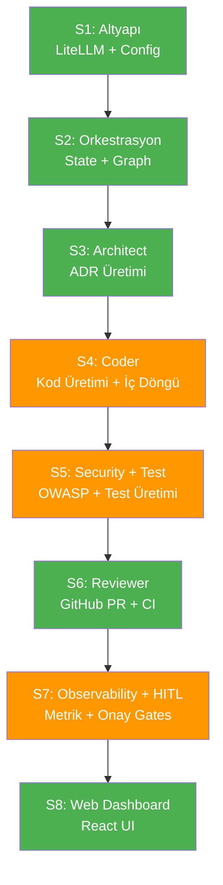

# 🏃 Sprint & PR Planı: Multi-Agent Otonom Mobil Uygulama Geliştirme Sistemi

> **Metodoloji:** Kanban-flavored Scrum (1 Sprint = 1 Hafta = 5 iş günü)  
> **Toplam:** 8 Sprint, ~11 PR, ~50 iş günü  
> **Başlangıç:** 16 Haziran 2026  
> **Tahmini Bitiş:** 8 Ağustos 2026

---

## 📋 İçindekiler

1. [Sprint Özet Tablosu](#1-sprint-özet-tablosu)
2. [Branch & PR Stratejisi](#2-branch--pr-stratejisi)
3. [Sprint Detayları (S1–S8)](#3-sprint-detayları)
4. [Definition of Done (DoD)](#4-definition-of-done-dod)
5. [Milestone'lar & Release Takvimi](#5-milestonelar--release-takvimi)
6. [Sprint Arası Bağımlılıklar](#6-sprint-arası-bağımlılıklar)
7. [Risk & Buffer Planı](#7-risk--buffer-planı)

---

## 1. Sprint Özet Tablosu



| Sprint | Hafta | Faz | PR Sayısı | Çıktı (Demo Edilebilir) |
|--------|-------|-----|-----------|------------------------|
| **S1** | H1 | Faz 1 — Altyapı | 1 PR | LiteLLM Router fallback çalışıyor, `pytest` geçiyor |
| **S2** | H2 | Faz 2 — Orkestrasyon | 1 PR | LangGraph boş akış + PostgreSQL checkpoint aktif |
| **S3** | H3 | Faz 3 — Architect Agent | 1 PR | Prompt → ADR JSON çıktısı üretilebiliyor |
| **S4** | H4–5 | Faz 4 — Coder + İç Döngü | 2 PR | Kod üretimi → Docker lint → self-fix → test pass |
| **S5** | H5–6 | Faz 5 — Security & Test | 2 PR | OWASP tarama + otomatik test üretimi çalışıyor |
| **S6** | H6–7 | Faz 6 — Reviewer + GitHub | 1 PR | PR açma → CI log → review → auto-merge akışı |
| **S7** | H7–8 | Faz 7 — Observability & HITL | 2 PR | Grafana dashboard + HITL onay akışı |
| **S8** | H8–9 | Faz 8 — Web Dashboard | 1 PR | Canlı dashboard, HITL onay UI'dan yapılabiliyor |
| | | | **Toplam: 11 PR** | |

---

## 2. Branch & PR Stratejisi

### 2.1 Branch Yapısı

```
main ← (korumalı, direkt push yok, sadece release merge)
 │
 └── develop ← (entegrasyon dalı, tüm feature PR'ları buraya merge edilir)
      │
      ├── feature/s1-infrastructure        →  PR#1   → develop
      ├── feature/s2-orchestrator          →  PR#2   → develop
      ├── feature/s3-architect-agent       →  PR#3   → develop
      ├── feature/s4-coder-agent           →  PR#4   → develop
      ├── feature/s4-inner-loop            →  PR#5   → develop
      ├── feature/s5-security-agent        →  PR#6   → develop
      ├── feature/s5-test-generator        →  PR#7   → develop
      ├── feature/s6-reviewer-github       →  PR#8   → develop
      ├── feature/s7-observability         →  PR#9   → develop
      ├── feature/s7-hitl-guardrails       →  PR#10  → develop
      └── feature/s8-web-dashboard         →  PR#11  → develop
```

### 2.2 Branch Kuralları

| Kural | Detay |
|-------|-------|
| **Adlandırma** | `feature/s{sprint_no}-{kısa-açıklama}` |
| **Merge stratejisi** | **Squash merge** (temiz, okunabilir commit geçmişi) |
| **Branch kaynağı** | Her feature branch `develop`'tan açılır |
| **Çakışma çözümü** | Feature branch, merge öncesi `develop`'tan rebase edilir |
| **Silme** | Merge sonrası feature branch silinir |

### 2.3 PR Şablonu

Her PR açılırken aşağıdaki şablon kullanılır:

```markdown
## 📝 Ne Yapıldı?
- [Değişikliklerin kısa listesi]

## 🔗 İlgili Sprint & Faz
- Sprint: S{x}
- Faz: Faz {y}

## ✅ Test Edildi Mi?
- [ ] `pytest tests/ -v` geçiyor
- [ ] `mypy src/ --strict` hata yok
- [ ] Manuel test yapıldı (açıklama: ...)

## 📸 Demo / Ekran Görüntüsü
[varsa ekran görüntüsü veya terminal çıktısı]

## ⚠️ Breaking Change Var Mı?
- Evet / Hayır (açıklama)
```

### 2.4 Branch Protection Kuralları (`develop` dalı)

| Kural | Değer |
|-------|-------|
| PR olmadan merge | ❌ Yasak |
| Minimum reviewer sayısı | 1 |
| Status check (CI) zorunlu | ✅ `pytest` + `mypy` |
| Force push | ❌ Yasak |
| Branch güncel olmalı | ✅ Rebase/merge required |

---

## 3. Sprint Detayları

---

### 🟢 Sprint 1 — Altyapı & LiteLLM Konfigürasyonu

| Bilgi | Detay |
|-------|-------|
| **Süre** | 5 iş günü (16–20 Haziran 2026) |
| **Faz** | Faz 1 |
| **Branch** | `feature/s1-infrastructure` |
| **Bağımlılık** | Yok (ilk sprint) |

#### PR#1: Proje İskeleti & LiteLLM Router

**Oluşturulacak/Değiştirilecek Dosyalar:**

| Dosya | Tür | Açıklama |
|-------|-----|----------|
| `pyproject.toml` | [NEW] | Python 3.11+ bağımlılıkları (`langgraph>=1.0.10`, `litellm>=1.50`, `pydantic>=2.0`, `fastapi`, `alembic`, `structlog`, `psycopg[pool]`, vb.) |
| `.env.example` | [NEW] | Tüm API key'ler, `LANGSMITH_TRACING=true`, `DATABASE_URL`, `REDIS_URL` |
| `.gitignore` | [NEW] | Python + Node.js + IDE + `.env` kuralları |
| `config/litellm_config.yaml` | [NEW] | Model tanımları (Gemini 2.5 Pro, Claude Sonnet 4, GPT-4o) + fallback chain |
| `config/guardrails.yaml` | [NEW] | İç döngü max: 3, dış döngü max: 5, maks maliyet: $10, token limitleri, timeout süresi, retry/backoff ayarları |
| `src/__init__.py` | [NEW] | Paket init |
| `src/integrations/__init__.py` | [NEW] | Paket init |
| `src/integrations/litellm_client.py` | [NEW] | `LiteLLMClient` sınıfı — `Router(model_list, fallbacks, num_retries=2)` wrapper, token tracking, maliyet hesaplama |
| `src/core/__init__.py` | [NEW] | Paket init |
| `src/core/config.py` | [NEW] | Pydantic `Settings` sınıfı (`.env` okuma, config merge) |
| `src/core/logging.py` | [NEW] | `structlog` yapılandırması — JSON formatında yapısal loglama |
| `tests/__init__.py` | [NEW] | Paket init |
| `tests/test_litellm_client.py` | [NEW] | LiteLLM Router unit testleri (mock ile fallback testi dahil) |

**Kabul Kriterleri:**
- [ ] `pip install -e .` hatasız tamamlanıyor
- [ ] LiteLLM Router 3 provider'a bağlanabiliyor (mock test ile)
- [ ] Fallback zinciri çalışıyor (birinci provider fail → ikinciye geçiş)
- [ ] `pytest tests/test_litellm_client.py -v` tüm testler geçiyor
- [ ] `mypy src/ --strict` hata yok
- [ ] `.env.example` tüm gerekli key'leri içeriyor
- [ ] `structlog` JSON log çıktısı üretiyor

---

### 🟢 Sprint 2 — Orkestrasyon & State

| Bilgi | Detay |
|-------|-------|
| **Süre** | 5 iş günü (23–27 Haziran 2026) |
| **Faz** | Faz 2 |
| **Branch** | `feature/s2-orchestrator` |
| **Bağımlılık** | S1 tamamlanmış olmalı (LiteLLM client gerekli) |

#### PR#2: LangGraph StateGraph & Checkpointing

**Oluşturulacak/Değiştirilecek Dosyalar:**

| Dosya | Tür | Açıklama |
|-------|-----|----------|
| `src/orchestrator/__init__.py` | [NEW] | Paket init |
| `src/orchestrator/state.py` | [NEW] | `AgentState(TypedDict)` + `Annotated` reducer'lar (`add_messages`, `operator.add`), Pydantic modeller (`UserRequest`, `AgentResponse`) |
| `src/orchestrator/graph.py` | [NEW] | `StateGraph(AgentState)` tanımı, supervisor node, `builder.compile(checkpointer=memory)` |
| `src/orchestrator/nodes.py` | [NEW] | Placeholder node fonksiyonları (her ajan için stub — gerçek implementasyon sonraki sprint'lerde) |
| `src/orchestrator/edges.py` | [NEW] | `should_continue_inner_loop()`, `should_escalate()`, `review_decision()`, `security_gate()`, `cost_check()` conditional edge fonksiyonları |
| `src/db/__init__.py` | [NEW] | Paket init |
| `src/db/models.py` | [NEW] | SQLAlchemy modelleri: `Project`, `HITLApproval`, `AgentRun`, `CostLog` |
| `src/db/session.py` | [NEW] | PostgreSQL bağlantısı, `psycopg_pool.ConnectionPool`, `PostgresSaver` init |
| `alembic.ini` | [NEW] | Alembic konfigürasyonu |
| `alembic/env.py` | [NEW] | Migration environment |
| `alembic/versions/001_initial.py` | [NEW] | İlk migration (tablolar: projects, hitl_approvals, agent_runs, cost_logs) |
| `docker-compose.yml` | [NEW] | Services: `postgres`, `redis` (geliştirme ortamı için) |
| `tests/test_state.py` | [NEW] | State reducer testleri |
| `tests/test_orchestrator.py` | [NEW] | Graph akış testleri (stub node'lar ile uçtan uca) |

**Kabul Kriterleri:**
- [ ] `docker-compose up -d postgres redis` çalışıyor
- [ ] `alembic upgrade head` migration başarılı
- [ ] LangGraph graph stub node'larla compile ediliyor
- [ ] PostgreSQL checkpointing aktif — state kaydedilip geri yüklenebiliyor
- [ ] Conditional edge'ler doğru yönlendirme yapıyor (mock state ile)
- [ ] `AgentState` reducer'ları doğru çalışıyor (`add_messages`, `operator.add`)
- [ ] `pytest tests/test_state.py tests/test_orchestrator.py -v` geçiyor

---

### 🟢 Sprint 3 — Architect Agent

| Bilgi | Detay |
|-------|-------|
| **Süre** | 5 iş günü (30 Haziran – 4 Temmuz 2026) |
| **Faz** | Faz 3 |
| **Branch** | `feature/s3-architect-agent` |
| **Bağımlılık** | S2 tamamlanmış olmalı (graph + state gerekli) |

#### PR#3: Architect Agent & ADR Üretimi

**Oluşturulacak/Değiştirilecek Dosyalar:**

| Dosya | Tür | Açıklama |
|-------|-----|----------|
| `src/agents/__init__.py` | [NEW] | Paket init |
| `src/agents/base.py` | [NEW] | `BaseAgent` abstract sınıfı — tüm ajanlar için ortak arayüz (`run()`, `get_model()`, `track_cost()`) |
| `src/agents/architect/__init__.py` | [NEW] | Paket init |
| `src/agents/architect/agent.py` | [NEW] | `ArchitectAgent(BaseAgent)` — `create_react_agent` ile oluşturulur. `analyze_requirements()`, `generate_adr()`, `select_tech_stack()` |
| `src/agents/architect/schemas.py` | [NEW] | Pydantic output şemaları: `ArchitectureDecision`, `FolderStructure`, `TechStack`, `ADRDocument` |
| `src/agents/architect/tools.py` | [NEW] | Architect'in kullanacağı tool'lar: `analyze_requirements_tool`, `generate_folder_structure_tool` |
| `config/prompts/architect_system.md` | [NEW] | Sistem promptu: platform seçimi mantığı, ADR formatı, Clean Architecture kuralları |
| `src/orchestrator/nodes.py` | [MODIFY] | `architect` stub → gerçek `ArchitectAgent` entegrasyonu |
| `src/orchestrator/graph.py` | [MODIFY] | Supervisor'a `make_handoff_tool("architect")` eklenmesi |
| `tests/test_architect.py` | [NEW] | Architect Agent testleri (mock LLM ile ADR üretimi, şema validasyonu) |

**Kabul Kriterleri:**
- [ ] Kullanıcı promptu verince yapılandırılmış ADR JSON çıktısı üretiliyor
- [ ] ADR çıktısı `ArchitectureDecision` Pydantic şemasına uyuyor
- [ ] Platform seçimi mantıksal (e-ticaret → React Native, performans-kritik → Flutter, vb.)
- [ ] Supervisor → Architect handoff çalışıyor
- [ ] Architect → Supervisor dönüşü state'e doğru yazıyor
- [ ] `pytest tests/test_architect.py -v` geçiyor

---

### 🟡 Sprint 4 — Coder Agent & İç Döngü (2 Hafta)

| Bilgi | Detay |
|-------|-------|
| **Süre** | 10 iş günü (7–18 Temmuz 2026) |
| **Faz** | Faz 4 |
| **Branch'ler** | `feature/s4-coder-agent`, `feature/s4-inner-loop` |
| **Bağımlılık** | S3 tamamlanmış olmalı (Architect ADR çıktısı gerekli) |

#### PR#4: Coder Agent — Kod Üretimi

**Oluşturulacak/Değiştirilecek Dosyalar:**

| Dosya | Tür | Açıklama |
|-------|-----|----------|
| `src/agents/coder/__init__.py` | [NEW] | Paket init |
| `src/agents/coder/agent.py` | [NEW] | `CoderAgent(BaseAgent)` — `generate_module()`, `self_fix()`. ADR'ye uygun modüler kod üretimi |
| `src/agents/coder/tools.py` | [NEW] | `generate_code_tool`, `read_lint_output_tool`, `apply_fix_tool` |
| `config/prompts/coder_system.md` | [NEW] | Sistem promptu: ADR'ye bağlılık, dosya formatı, incremental üretim kuralları |
| `src/orchestrator/nodes.py` | [MODIFY] | `coder` stub → gerçek `CoderAgent` entegrasyonu |
| `src/orchestrator/graph.py` | [MODIFY] | Supervisor'a `make_handoff_tool("coder")` eklenmesi |
| `tests/test_coder.py` | [NEW] | Coder Agent testleri (mock LLM ile kod üretimi, modül formatı doğrulama) |

**Kabul Kriterleri (PR#4):**
- [ ] Architect ADR'sine uygun modül kodu üretiliyor
- [ ] Çıktı formatı: `{dosya_yolu: str, içerik: str}` çiftleri
- [ ] Modül bazlı incremental üretim çalışıyor
- [ ] State'e `source_code` doğru yazılıyor

#### PR#5: İç Döngü — Docker Lint/Test & Self-Fix

**Oluşturulacak/Değiştirilecek Dosyalar:**

| Dosya | Tür | Açıklama |
|-------|-----|----------|
| `src/agents/coder/inner_loop.py` | [NEW] | `InnerLoopRunner` — Docker'da lint → test → sonuç. Max 3 iterasyon self-fix |
| `src/integrations/docker_runner.py` | [NEW] | `DockerRunner` — container oluşturma, kod kopyalama, komut çalıştırma, log toplama, timeout yönetimi |
| `src/orchestrator/edges.py` | [MODIFY] | `should_continue_inner_loop()` gerçek implementasyonu |
| `docker/Dockerfile.node` | [NEW] | React Native/Node.js projeler için lint/test container image |
| `docker/Dockerfile.dart` | [NEW] | Flutter/Dart projeler için lint/test container image |
| `tests/test_inner_loop.py` | [NEW] | İç döngü testleri (mock Docker ile lint fail → self-fix → pass senaryosu) |

**Kabul Kriterleri (PR#5):**
- [ ] Docker container'da lint çalıştırılabiliyor (ESLint veya Dart Analyzer)
- [ ] Lint hataları Coder Agent'a geri beslenip self-fix döngüsü çalışıyor
- [ ] Maks. 3 iterasyon sonra escalation tetikleniyor
- [ ] Unit test runner Docker'da çalışıyor
- [ ] Container timeout mekanizması aktif
- [ ] `pytest tests/test_inner_loop.py -v` geçiyor

---

### 🟡 Sprint 5 — Security Agent & Test Generator

| Bilgi | Detay |
|-------|-------|
| **Süre** | 6 iş günü (21–28 Temmuz 2026) |
| **Faz** | Faz 5 |
| **Branch'ler** | `feature/s5-security-agent`, `feature/s5-test-generator` |
| **Bağımlılık** | S4 tamamlanmış olmalı (Coder çıktısı gerekli) |

#### PR#6: Security Agent

**Oluşturulacak/Değiştirilecek Dosyalar:**

| Dosya | Tür | Açıklama |
|-------|-----|----------|
| `src/agents/security/__init__.py` | [NEW] | Paket init |
| `src/agents/security/agent.py` | [NEW] | `SecurityAgent(BaseAgent)` — `scan_code()`, `audit_dependencies()`, `detect_secrets()`, güvenlik skoru (0-100) |
| `src/agents/security/owasp_rules.py` | [NEW] | OWASP Mobile Top 10 kural tanımları + severity mapping |
| `src/agents/security/tools.py` | [NEW] | `run_semgrep_tool`, `run_gitleaks_tool`, `check_dependencies_tool` |
| `config/prompts/security_system.md` | [NEW] | Sistem promptu: OWASP kontrol listesi, CVE analiz formatı, severity eşikleri |
| `src/orchestrator/nodes.py` | [MODIFY] | `security_scan` stub → gerçek implementasyon |
| `src/orchestrator/edges.py` | [MODIFY] | `security_gate()` — score < 80 → Coder'a geri, kritik CVE → HITL gate |
| `tests/test_security.py` | [NEW] | Security Agent testleri (bilinen vulnerable kod örnekleri ile) |

**Kabul Kriterleri (PR#6):**
- [ ] Semgrep kuralları ile SAST tarama yapılabiliyor
- [ ] GitLeaks ile secret detection çalışıyor
- [ ] Güvenlik skoru hesaplanıyor (0-100)
- [ ] Score < 80 → Coder'a geri gönderme akışı çalışıyor
- [ ] Kritik CVE → HITL gate tetikleniyor

#### PR#7: Test Generator Agent

**Oluşturulacak/Değiştirilecek Dosyalar:**

| Dosya | Tür | Açıklama |
|-------|-----|----------|
| `src/agents/test_generator/__init__.py` | [NEW] | Paket init |
| `src/agents/test_generator/agent.py` | [NEW] | `TestGeneratorAgent(BaseAgent)` — `generate_unit_tests()`, `generate_widget_tests()`, `generate_integration_tests()` |
| `src/agents/test_generator/tools.py` | [NEW] | `analyze_code_structure_tool`, `run_coverage_tool` |
| `config/prompts/test_generator_system.md` | [NEW] | Sistem promptu: test yazma kuralları, coverage hedefi ≥70%, test framework'leri |
| `src/orchestrator/nodes.py` | [MODIFY] | `test_generator` stub → gerçek implementasyon |
| `tests/test_test_generator.py` | [NEW] | Test Generator testleri (basit fonksiyon → üretilen test doğrulaması) |

**Kabul Kriterleri (PR#7):**
- [ ] Verilen kaynak kod için unit test üretiliyor
- [ ] Üretilen testler Docker'da çalıştırılıp coverage raporlanıyor
- [ ] Coverage ≥ 70% hedefi kontrol ediliyor
- [ ] Yetersiz coverage durumunda ek test üretimi tetikleniyor

---

### 🟢 Sprint 6 — Reviewer Agent & GitHub Entegrasyonu

| Bilgi | Detay |
|-------|-------|
| **Süre** | 5 iş günü (29 Temmuz – 4 Ağustos 2026) |
| **Faz** | Faz 6 |
| **Branch** | `feature/s6-reviewer-github` |
| **Bağımlılık** | S5 tamamlanmış olmalı (Security + Test çıktıları gerekli) |

#### PR#8: Reviewer Agent & GitHub PR Yönetimi

**Oluşturulacak/Değiştirilecek Dosyalar:**

| Dosya | Tür | Açıklama |
|-------|-----|----------|
| `src/agents/reviewer/__init__.py` | [NEW] | Paket init |
| `src/agents/reviewer/agent.py` | [NEW] | `ReviewerAgent(BaseAgent)` — `review_code()`, `analyze_ci_logs()`, `create_pr_review()`. PASS/FAIL karar mekanizması |
| `src/agents/reviewer/tools.py` | [NEW] | `review_code_tool`, `parse_ci_logs_tool`, `submit_pr_review_tool` |
| `config/prompts/reviewer_system.md` | [NEW] | Sistem promptu: SOLID prensipleri, Clean Code kuralları, review formatı |
| `src/integrations/github_client.py` | [NEW] | `GitHubClient` — `create_branch()`, `commit_files()`, `create_pull_request()`, `get_ci_logs()`, `submit_review()`, `auto_merge()` |
| `src/orchestrator/nodes.py` | [MODIFY] | `reviewer` stub → gerçek implementasyon |
| `src/orchestrator/edges.py` | [MODIFY] | `review_decision()` — PASS → deploy, FAIL → feedback + Coder'a dönüş |
| `tests/test_reviewer.py` | [NEW] | Reviewer testleri (mock CI logları, PR review formatı doğrulama) |
| `tests/test_github_client.py` | [NEW] | GitHub client testleri (mock PyGithub ile PR lifecycle) |

**Kabul Kriterleri:**
- [ ] GitHub'da otomatik branch oluşturma + dosya commit + PR açma çalışıyor
- [ ] CI logları parse edilebiliyor
- [ ] Reviewer PASS/FAIL kararı veriyor
- [ ] FAIL durumunda inline comment'lerle feedback Coder'a ulaşıyor
- [ ] PASS + tüm check'ler geçince auto-merge tetikleniyor
- [ ] Dış döngü max 5 iterasyon koruması aktif

---

### 🟡 Sprint 7 — Observability & HITL (2 Hafta)

| Bilgi | Detay |
|-------|-------|
| **Süre** | 8 iş günü (5–14 Ağustos 2026) |
| **Faz** | Faz 7 |
| **Branch'ler** | `feature/s7-observability`, `feature/s7-hitl-guardrails` |
| **Bağımlılık** | S6 tamamlanmış olmalı (tüm ajanlar hazır) |

#### PR#9: LangSmith + Prometheus + Grafana

**Oluşturulacak/Değiştirilecek Dosyalar:**

| Dosya | Tür | Açıklama |
|-------|-----|----------|
| `src/observability/__init__.py` | [NEW] | Paket init |
| `src/observability/langsmith_tracer.py` | [NEW] | LangSmith callback handler — `LANGSMITH_TRACING=true` otomatik trace doğrulaması, custom span'lar |
| `src/observability/metrics.py` | [NEW] | Prometheus metrikleri: `agent_loop_count`, `agent_token_usage`, `agent_cost_per_task`, `ci_build_duration_seconds`, `review_rejection_total` |
| `monitoring/prometheus.yml` | [NEW] | Prometheus scrape config — FastAPI `/metrics` endpoint |
| `monitoring/grafana/dashboards/agents.json` | [NEW] | Grafana dashboard JSON: ajan performansı, maliyet, döngü sayısı, hata oranları |
| `monitoring/grafana/provisioning/datasources.yml` | [NEW] | Grafana → Prometheus datasource otomatik konfigürasyonu |
| `src/api/main.py` | [MODIFY] | `/metrics` Prometheus endpoint eklenmesi |
| `docker-compose.yml` | [MODIFY] | `prometheus` ve `grafana` servisleri eklenmesi |
| `tests/test_metrics.py` | [NEW] | Metrik counter/gauge testleri |

**Kabul Kriterleri (PR#9):**
- [ ] LangSmith'te graph execution trace'leri görünüyor
- [ ] Prometheus `/metrics` endpoint çalışıyor
- [ ] Grafana dashboard'da tüm metrikler görüntüleniyor
- [ ] Alert kuralları tanımlı (loop > 8, cost > $5)

#### PR#10: HITL Gates & Guardrails

**Oluşturulacak/Değiştirilecek Dosyalar:**

| Dosya | Tür | Açıklama |
|-------|-----|----------|
| `src/orchestrator/hitl.py` | [NEW] | `HITLGate` sınıfı — 4 gate: mimari onay, güvenlik escalation, deploy onayı, bütçe aşımı. Bekleme + timeout mekanizması |
| `src/orchestrator/guardrails.py` | [NEW] | `GuardrailsEngine` — maliyet kontrolü (threshold aşımında durdurma), token limiti, iterasyon limiti, `guardrails.yaml` okuma |
| `src/orchestrator/graph.py` | [MODIFY] | HITL node'larının graph'a eklenmesi, `interrupt_before` konfigürasyonu |
| `src/api/main.py` | [MODIFY] | `/api/hitl/{id}/approve` endpoint implementasyonu, WebSocket HITL bildirim akışı |
| `tests/test_hitl.py` | [NEW] | HITL gate testleri (timeout, approve, reject senaryoları) |
| `tests/test_guardrails.py` | [NEW] | Guardrail testleri (maliyet aşımı, iterasyon limiti) |

**Kabul Kriterleri (PR#10):**
- [ ] Mimari karar sonrası HITL gate tetikleniyor ve onay bekliyor
- [ ] Kritik CVE bulunduğunda güvenlik HITL gate'i devreye giriyor
- [ ] Deploy öncesi onay gate'i çalışıyor
- [ ] Maliyet threshold aşıldığında tüm ajanlar duruyor
- [ ] Timeout sonrası otomatik escalation oluyor
- [ ] `/api/hitl/{id}/approve` endpoint'i çalışıyor

---

### 🟢 Sprint 8 — Web Dashboard (UI)

| Bilgi | Detay |
|-------|-------|
| **Süre** | 7 iş günü (15–25 Ağustos 2026) |
| **Faz** | Faz 8 |
| **Branch** | `feature/s8-web-dashboard` |
| **Bağımlılık** | S7 tamamlanmış olmalı (API + HITL endpoint'leri hazır) |

#### PR#11: React Dashboard & WebSocket Entegrasyonu

**Oluşturulacak/Değiştirilecek Dosyalar:**

| Dosya | Tür | Açıklama |
|-------|-----|----------|
| `frontend/package.json` | [NEW] | React 19, TypeScript, Vite, Zustand, Recharts, Lucide React bağımlılıkları |
| `frontend/vite.config.ts` | [NEW] | Vite konfigürasyonu — API proxy (`/api` → FastAPI), HMR |
| `frontend/tsconfig.json` | [NEW] | TypeScript strict mode konfigürasyonu |
| `frontend/index.html` | [NEW] | HTML entry point — Google Fonts (Inter, Outfit) |
| `frontend/src/main.tsx` | [NEW] | React DOM render entry |
| `frontend/src/index.css` | [NEW] | Global CSS — karanlık tema CSS variables, premium renk paleti, mikro-animasyonlar, tipografi |
| `frontend/src/App.tsx` | [NEW] | Ana layout — sidebar navigation, proje listesi, detay paneli |
| `frontend/src/stores/projectStore.ts` | [NEW] | Zustand store — proje state, WebSocket güncellemeleri, HITL state |
| `frontend/src/hooks/useWebSocket.ts` | [NEW] | WebSocket custom hook — `/api/projects/{id}/stream` bağlantısı, otomatik reconnect |
| `frontend/src/components/ProjectForm.tsx` | [NEW] | Yeni proje oluşturma formu (prompt, platform seçimi, tercihler) |
| `frontend/src/components/AgentGraph.tsx` | [NEW] | LangGraph akış görselleştirici — aktif node vurgulama, tamamlanan adım animasyonları |
| `frontend/src/components/HITLPanel.tsx` | [NEW] | HITL onay paneli — ADR inceleme, güvenlik raporu, diff viewer, approve/reject/feedback |
| `frontend/src/components/TerminalLogs.tsx` | [NEW] | Canlı terminal log penceresi — Docker lint/test çıktıları, ajan düşünce logları |
| `frontend/src/components/MetricCards.tsx` | [NEW] | Maliyet kartı (USD), token kullanımı, geçen süre, iterasyon sayacı — Recharts grafikleri |
| `frontend/src/components/ProjectList.tsx` | [NEW] | Geçmiş ve aktif projelerin listesi, durum badge'leri |
| `frontend/public/` | [NEW] | Statik dosyalar dizini |
| `docker-compose.yml` | [MODIFY] | `frontend` servisi eklenmesi (port 3000, API proxy) |
| `src/api/main.py` | [MODIFY] | CORS ayarları (frontend origin izni), WebSocket broadcast mekanizması |

**Kabul Kriterleri:**
- [ ] `cd frontend && npm install && npm run dev` hatasız çalışıyor
- [ ] `npm run build` (TypeScript type check) hata vermiyor
- [ ] Dashboard karanlık tema ile premium görünüyor
- [ ] Proje oluşturma formu API'ye POST yapabiliyor
- [ ] WebSocket üzerinden canlı ajan durumu akıyor
- [ ] AgentGraph component aktif node'u vurguluyor
- [ ] HITL paneli açılıyor ve approve/reject API'ye ulaşıyor
- [ ] Terminal logları canlı akıyor
- [ ] Metrik kartları doğru verileri gösteriyor
- [ ] Responsive tasarım (desktop + tablet)

---

## 4. Definition of Done (DoD)

Her sprint PR'ı merge edilmeden önce aşağıdaki tüm maddeler sağlanmalıdır:

### Kod Kalitesi
- [ ] Tüm yeni fonksiyonlar/sınıflar için docstring yazılmış
- [ ] Type hint'ler eksiksiz (`mypy --strict` geçiyor)
- [ ] Kod tekrarı minimumda (DRY prensibi)
- [ ] Fonksiyonlar tek sorumluluk prensibine (SRP) uyuyor

### Test
- [ ] Yeni kod için unit test yazılmış
- [ ] `pytest tests/ -v` — tüm testler geçiyor
- [ ] `mypy src/ --strict` — tip hatası yok
- [ ] Frontend değişikliklerinde `npm run build` başarılı

### Dokümantasyon
- [ ] Yeni dosyalar `README.md`'ye eklenmiş
- [ ] Karmaşık iş mantığı yorum satırlarıyla açıklanmış
- [ ] API endpoint değişikliklerinde OpenAPI dökümantasyonu güncel

### PR
- [ ] PR şablonu doldurulmuş
- [ ] En az 1 reviewer onayı alınmış
- [ ] CI pipeline geçiyor
- [ ] Squash merge yapılmış

---

## 5. Milestone'lar & Release Takvimi



| Milestone | Sprint Sonu | Tag | Release İçeriği | `develop → main` Merge |
|-----------|-------------|-----|-----------------|----------------------|
| **M1: Core Engine** | S3 sonu | `v0.1-alpha` | LiteLLM + LangGraph + Architect Agent çalışıyor | ✅ İlk merge |
| **M2: Full Pipeline** | S6 sonu | `v0.5-beta` | Tüm ajanlar + iç/dış döngü + GitHub entegrasyonu | ✅ İkinci merge |
| **M3: Production Ready** | S8 sonu | `v1.0-rc` | Observability + HITL + Web Dashboard | ✅ Final merge |

### Release Checklist (her milestone sonunda)

- [ ] Tüm sprint PR'ları `develop`'a merge edilmiş
- [ ] `develop` dalında tüm testler geçiyor
- [ ] E2E akış testi yapılmış
- [ ] Bilinen bug'lar dokümante edilmiş
- [ ] `develop → main` merge + tag oluşturulmuş
- [ ] Release notes yazılmış

---

## 6. Sprint Arası Bağımlılıklar



**Kritik Bağımlılık Zinciri:**

| Sprint | Sert Bağımlılık | Bloke Olursa... |
|--------|----------------|-----------------|
| S2 | S1 (LiteLLM client) | Graph node'ları LLM çağrısı yapamaz |
| S3 | S2 (Graph + State) | Architect Agent graph'a eklenemez |
| S4 | S3 (ADR çıktısı) | Coder neye göre kod üreteceğini bilemez |
| S5 | S4 (Üretilen kod) | Taranacak/test edilecek kod yok |
| S6 | S5 (Security + Test raporu) | Reviewer eksik bilgiyle karar verir |
| S7 | S6 (Tüm ajanlar) | Metrik toplanacak ajan yok |
| S8 | S7 (API + HITL endpoint) | Frontend bağlanacak backend yok |

> [!WARNING]
> Sprint'ler sıralı bağımlıdır — paralel çalıştırma mümkün değildir. Bir sprint'teki gecikme tüm sonraki sprint'leri kaydırır. Buffer süreleri bu riski azaltmak için ayrılmıştır (Bölüm 7).

---

## 7. Risk & Buffer Planı

### Sprint Bazlı Risk Değerlendirmesi

| Sprint | Risk Seviyesi | Ana Risk | Buffer |
|--------|--------------|----------|--------|
| S1 | 🟢 Düşük | LiteLLM API uyumsuzluğu | 1 gün |
| S2 | 🟡 Orta | LangGraph API breaking changes | 2 gün |
| S3 | 🟢 Düşük | Prompt engineering iterasyonu | 1 gün |
| S4 | 🔴 Yüksek | Docker cross-platform sorunları, self-fix döngü karmaşıklığı | 3 gün |
| S5 | 🟡 Orta | Semgrep/GitLeaks entegrasyon sorunları | 2 gün |
| S6 | 🟡 Orta | GitHub API rate limiting, webhook konfigürasyonu | 2 gün |
| S7 | 🟢 Düşük | Grafana dashboard tasarımı | 1 gün |
| S8 | 🟡 Orta | WebSocket bağlantı yönetimi, UI/UX iterasyonu | 2 gün |
| | | **Toplam Buffer** | **14 gün** |

### Gecikme Senaryoları

| Senaryo | Etki | Aksiyon |
|---------|------|---------|
| Sprint 1-2 gün gecikirse | Tolere edilir | Buffer'dan karşılanır |
| Sprint 3+ gün gecikirse | Sonraki sprint etkilenir | Kapsam daraltma (scope cut) |
| Kritik bağımlılık kırılırsa | Tüm zincir durur | Hotfix branch açılır, acil müdahale |

### Kapsam Daraltma Öncelikleri (Gerekirse Çıkarılacaklar)

Eğer zaman baskısı olursa, aşağıdaki sırayla kapsam daraltılır (en az kritikten en kritiğe):

1. 🔵 **İlk çıkar:** Grafana dashboard detayları (Prometheus yeterli)
2. 🔵 **İlk çıkar:** Widget/integration test üretimi (unit test yeterli)
3. 🟡 **Gerekirse çıkar:** Frontend MetricCards bileşeni (ham veri API'den okunur)
4. 🟡 **Gerekirse çıkar:** Auto-merge (manuel merge yapılır)
5. 🔴 **Asla çıkmaz:** HITL gates, Security Agent, Checkpointing, Inner Loop

---

## 📎 İlgili Dokümanlar

| Doküman | Açıklama |
|---------|----------|
| [01_hybrid_architecture_analysis.md](./01_hybrid_architecture_analysis.md) | Hibrit mimari detayları, UI katmanı, production-grade öneriler |
| [02_implementation_plan.md](./02_implementation_plan.md) | Dosya bazlı implementasyon planı (8 faz, ~43 dosya) |
| [03_roadmap.md](./03_roadmap.md) | Uçtan uca yol haritası, KPI'lar, risk analizi |

---

> [!NOTE]
> Bu sprint planı yaşayan bir belgedir. Her sprint başında ve sonunda güncellenir.
>
> **Son güncelleme:** 16 Haziran 2026
